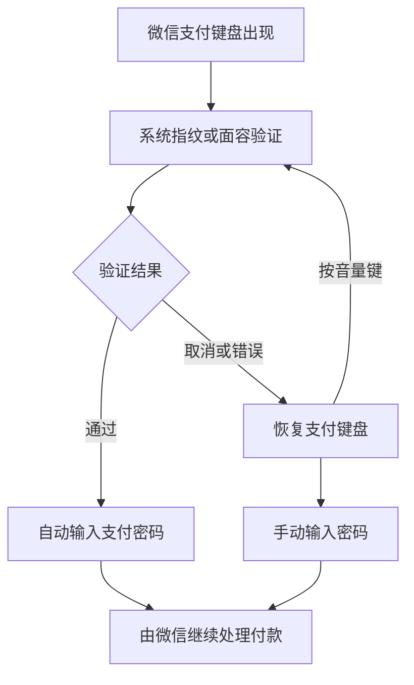

<h1>BioPay</h1>

验证指纹或面容，轻松完成微信支付

Pay in WeChat with your fingerprint or face

[简体中文](README.md) | [English](https://github.com/kiriashi/BioPay/blob/main/README_EN.md)

## 项目简介

**BioPay** 让你在微信付款时，通过指纹或面容验证自动输入支付密码。即使微信没有为你的设备提供生物支付选项，也可以使用这套方式完成付款。

支持微信内付款和其他应用调起的微信支付，采用强指纹+弱面容的认证组合，能完美兼容不同厂商设备。

## 界面预览

  

## 可以做什么

| 功能 | 使用体验 |
| --- | --- |
| 指纹、面容与双选模式 | 在设置页选择适合自己的验证方式 |
| 自动输入支付密码 | 微信支付键盘出现时发起验证，通过后自动输入 |
| Class 1 面容兼容 | 部分原本无法用于支付的面容设备也能使用，无需额外兼容模块 |
| 指纹错误提示处理 | 自动跳过指定的微信指纹系统错误提示，并尝试继续页面流程 |
| 手动输入回退 | 取消验证或遇到错误时，恢复支付键盘 |
| 音量键切换 | 验证时按音量键返回键盘；在键盘状态下按音量键重新验证 |
| 本机加密保存 | 支付密码加密保存在设备上，模块不联网 |

## 支付流程

识别未通过时，可以继续尝试。BioPay 只协助输入密码，最终支付结果以微信提示为准。

## 安装与设置

**需要：** Android 9.0+ 版本、支持 LibXposed API 102 的 LSPosed，以及设备上已录入的指纹或面容。

1. 从 [Releases](https://github.com/kiriashi/BioPay/releases) 下载正式版 APK 并安装。
2. 在 LSPosed 中启用 BioPay，勾选微信作用域。
3. 强制停止微信，再重新打开。
4. 进入微信“我 → 设置”，长按页面标题“设置”，打开 BioPay 设置页。
5. 输入六位微信支付密码，选择指纹、面容或双选模式，完成验证后保存。
6. 下次付款时，按系统提示验证即可。

### 弱面容设备兼容设置

部分厂商会将设备的面部识别传感器的安全等级定义为 **Class 1**（便利级，值4095）从而导致 **BiometricPrompt** 无法调用。本模块可在微信面容认证预检中，让这类传感器满足 **Class 2**（弱生物识别）请求，并与 Class 3 指纹区分。如果您的设备无法正常使用面容支付，可尝试在 LSPosed 中额外勾选 BioPay 的“系统框架（system）”作用域，然后**重启手机**即可开启。

普通指纹和面容支付正常的设备无需勾选，仅勾选微信作用域即可使用。

注意：兼容处理仅在微信面容认证预检中放行 Class 1 传感器的 Class 2 请求，不会让它满足 Class 3 请求。它不会提高面容传感器本身的防伪能力，请根据设备情况决定是否启用。

感谢 [FaceBiometricFix](https://github.com/WAYYYAW/FaceBiometricFix) 项目提供的 Class 1 面容兼容技术思路。

## 日常使用

- **切换验证方式：** 打开 BioPay 设置页，选择模式并验证后保存。
- **临时手动输入：** 点击取消验证按钮，或使用系统的返回导航栏按钮。
- **重新验证：** 在支付键盘显示时按一次音量键可切换到生物认证页面。
- **关闭功能：** 在设置页关闭指纹和面容开关后保存，微信恢复普通密码支付。
- **清除密码：** 长按设置页的清除按钮，按提示完成验证后清除。

## 隐私与安全

- 支付密码加密保存在本机，模块不请求联网权限，也不会上传密码或生物信息。
- 指纹和面容由系统负责识别；BioPay 在收到验证成功后才解密并输入密码。
- 兼容面容设备的验证不等同于硬件绑定的密码解密保护。
- 源代码绿色开源，按 [AGPL-3.0](https://github.com/kiriashi/BioPay/blob/main/LICENSE) 公开，可自行审阅。

## 遇到问题

先确认 LSPosed 中模块及作用域已启用、设备已录入生物信息，并在更新后重启手机。如果微信更新后功能失效，请在 [Issues](https://github.com/kiriashi/BioPay/issues) 提供手机型号、Android、微信及 LSPosed 版本，以及具体操作和错误提示；不要提供支付密码。

也可以加入 [Telegram 交流群](https://t.me/biopaychat)。

## 开源协议与免责声明

Copyright (C) 2026 kiriashi。项目以 [GNU Affero General Public License v3.0](https://github.com/kiriashi/BioPay/blob/main/LICENSE) 或更新版本开源，修改和再分发须遵守该协议。

请仅在自己有权使用和修改的设备、账号上使用，并遵守相关法律及平台规则。本项目不提供任何担保；使用产生的账号、数据或支付风险由使用者自行承担。
